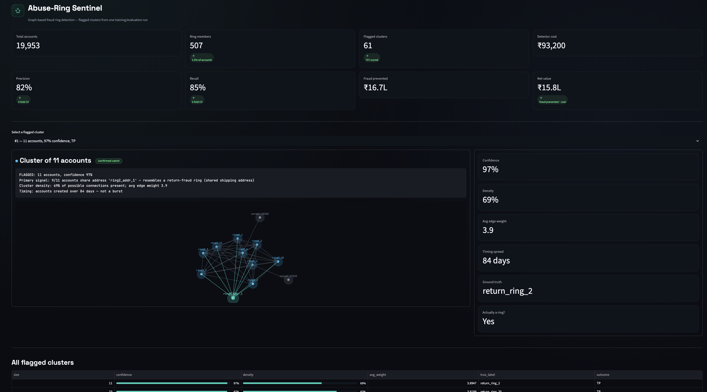
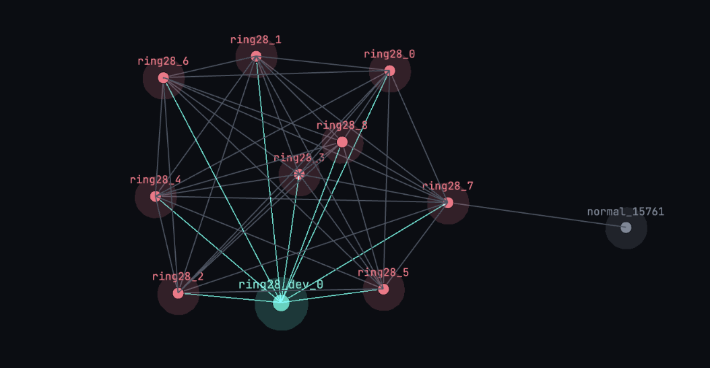

# Abuse-Ring Sentinel

**Graph-based detection of coordinated fraud rings.**
Razorpay AI Buildathon 2026 — Track 02: AI Risk Manager

A working detector for fraud rings — groups of accounts that look independent
individually but are secretly connected through shared infrastructure (a
device, an IP, a payout VPA, an address). Single-transaction and single-account
fraud models are structurally blind to this pattern: no individual row looks
suspicious. This project detects it at the graph level instead.

**Measured, cross-validated: 82% precision, 85% recall. Estimated net value:
₹15.8L, under stated cost assumptions.** See [Results](#results) for the full
picture, including what's honestly *not* solved yet.




---

## Quick start

```bash
pip install pandas numpy networkx scikit-learn matplotlib plotly streamlit jupyter

# 1. Run the notebook — generates the data + dashboard_data.json
jupyter nbconvert --to notebook --execute --inplace ringFraudDetect.ipynb

# 2. Run the dashboard
streamlit run app.py
```

Opens at `localhost:8501`. Full details, including a reproducibility caveat
worth reading before trusting a partial re-run, are in
[How to run](#how-to-run) below.

---

## The problem

A fraud ring — 15 "different" promo accounts sharing two devices, a return-fraud
household funneling refunds to one address, a mule network routing money
through one payout VPA — never trips a single-transaction fraud model, because
each individual account and transaction looks completely ordinary. The tell
only exists at the level of *relationships between accounts that are supposed
to be independent*. That's a graph problem, not a row-classification problem.

## Approach, in one picture

```
accounts + resources (device/IP/VPA/address)
        │
        ▼
  bipartite graph  (account ── resource edges: "this account used that device")
        │  projected — two accounts connect if they share a resource,
        │  edge weight = how meaningful that resource is to share
        ▼
  weighted account-account graph
        │  Louvain community detection — finds clusters that are more
        │  densely connected internally than to the rest of the graph
        ▼
  candidate communities
        │  engineered per-community features (size, density, edge weight,
        │  timestamp spread) → Random Forest classifier
        ▼
  flagged clusters + plain-English explanation + ₹ cost/value estimate
        │
        ▼
  Streamlit dashboard
```

## Graph concepts used here

**Bipartite graph.** Two node types — accounts and resources — with edges only
crossing that boundary (`account —— resource`), because that's literally what
the raw data says: "this account used that device." No relationship is assumed
yet at this stage.

**Projection.** Two accounts are secretly related if they share a *common
neighbor* in the resource layer. Projecting the bipartite graph onto the
account side means: drop the resource nodes, and connect any two accounts that
shared one, directly. This turns "who used what" into "who's connected to
whom" — the actual graph the detector reasons over.

**Weighted edges, not just connected/unconnected.** A shared IP and a shared
payout VPA are not equally suspicious — IP overlap is common and innocent
(campus wifi, NAT, a cell tower); sharing a payout destination with a stranger
essentially never happens by accident. Edge weight = `device: 3, ip: 1,
payout_vpa: 5, address: 4`, summed if a pair shares more than one resource.

**Louvain community detection.** An unsupervised algorithm that finds groups of
nodes more densely connected to each other than modularity (a measure of
"more connected than chance would predict") says they should be. It never sees
the ground-truth ring labels — only the graph structure — which is what makes
recovering the planted rings a real test rather than a circular one.

**The birthday-paradox pool-sizing insight.** Early on, resource pools (device
IDs, VPAs, etc.) were sized close to the account count, on the theory that "a
few innocent overlaps happen naturally." This was a mistake: with `n` accounts
drawn from a pool of size `N`, the expected number of *purely accidental*
collision pairs is roughly `n²/(2N)` — the same math behind the classic
"23 people, 365 birthdays, 50% chance of a match" puzzle, because you're
checking *every pair*, not one draw against one slot. With pools too close to
the account count, this produced hundreds of meaningless noise edges that
buried the real ring signal entirely — Louvain recovered almost nothing.
Fixed by sizing pools (300K+ for device/VPA/address, 65K for IP — IP kept
smaller on purpose, since real IP overlap between strangers *is* common) so
accidental collisions become rare enough that a shared resource is actually
evidence of something.

## Data

Synthetic, and deliberately so — no public dataset labels which accounts are
secretly the same coordinated fraud ring (see [Why synthetic
data](#why-synthetic-data-not-a-public-dataset) below). Generated at:

- **19,953 total accounts**, **507 ring members** (**2.5% fraud rate** —
  deliberately inflated above real-world rates, usually well under 1%,
  specifically to get enough labeled ring *instances* for statistically
  meaningful cross-validation in a synthetic demo; stated here explicitly
  rather than implied to be realistic)
- **45 ring instances**, 15 each of three patterns grounded in real fraud
  typologies:
  - **Promo/coupon abuse** — heavy device reuse + accounts created in a tight
    time burst
  - **Return fraud** — shared/near-duplicate shipping address, timestamps
    spread over months (not a burst)
  - **Money mule networks** — *only* the payout VPA is shared; device, IP,
    address, and timing all look completely ordinary. The hardest pattern by
    design, since real mule proceeds have to land somewhere even when
    everything else is varied.
- Plus **10 "legit overlap" clusters** (a family sharing one address, an
  office sharing one wifi router) that are **not** fraud — included
  specifically to test whether the detector can tell "suspicious
  coordination" apart from "ordinary human overlap," not just random noise.

### Why synthetic data, not a public dataset

Checked specifically, not assumed: the datasets that actually surface for this
(Kaggle Credit Card Fraud, the Bank Account Fraud Dataset Suite from NeurIPS
2022, PaySim) are all **row-level** labeled — one transaction or application,
one fraud flag. None label which accounts are secretly the same ring; Kaggle
Credit Card's features are even PCA-anonymized specifically so nothing
identifiable survives. This is structural, not incidental: a company holding
real "these N accounts are one ring" labels is holding exactly the
information that would teach a fraudster how the ring got caught. Even
industry write-ups from companies selling graph-based fraud tooling
demonstrate the technique on proprietary data, never a public benchmark — the
same reason this buildathon can't hand contestants Razorpay's real merchant
graph either.

## Model

Community-level features (not account-level): `size`, `density` (internal
edges ÷ possible pairs), `avg_weight`/`max_weight`, `timestamp_std_hours`.
A deliberately constrained **Random Forest** (`n_estimators=50, max_depth=4,
class_weight="balanced"`) — kept small on purpose, since the labeled sample
(59 ring-dominant communities out of 757 scored) is small enough that a larger
model would just memorize noise.

## Results

**5-fold `StratifiedGroupKFold` cross-validation** (grouped by underlying ring
identity, so fragments of the same ring never leak across train/test):

| Fold | Precision | Recall | F1 |
|---|---|---|---|
| 0 | 0.82 | 0.75 | 0.78 |
| 1 | 0.79 | 0.92 | 0.85 |
| 2 | 0.77 | 0.83 | 0.80 |
| 3 | 0.85 | 0.92 | 0.88 |
| 4 | 0.90 | 0.82 | 0.86 |

**Mean: precision 0.82 ± 0.05, recall 0.85 ± 0.06.** The tight spread across
folds — not swinging between extremes — is itself evidence the number is
trustworthy, in contrast to an earlier single train/test split that reported a
meaningless 100%/100% off only 2-3 test examples.

**Feature importances:** `avg_weight` (0.365) and `size` (0.352) dominate;
`timestamp_std_hours` (0.165) — the promo-ring burst signal — earns its keep;
`density` (0.077) and `max_weight` (0.040) matter less.

### False-positive cost, in ₹

Out-of-fold confusion matrix over all 757 communities: **TP=50, FP=11, FN=9,
TN=687.** Cross-check: `50/59 = 84.7%` recall, `50/61 = 82.0%` precision —
matches the cross-validation mean almost exactly.

Cost assumptions (explicitly stated, not real Razorpay figures):
`₹200`/flagged cluster (analyst review, ~20 min @ ₹600/hr, charged per case
not per account), `₹1,000`/wrongly-flagged legitimate account (support/
goodwill/churn-risk), `₹3,000`/account in a real ring (assumed average
fraudulent payout).

```
Flagged clusters (TP+FP): 61   → review cost:            ₹12,200
False positives: 11 clusters   → friction cost:           ₹81,000
                                  Total detector cost:     ₹93,200

True positives: 50 rings caught (558 accounts) → fraud value prevented: ₹16.74L
False negatives: 9 rings missed (72 accounts)  → fraud value still lost: ₹2.16L

Net value: ₹15.8L
```

The exact rupee figure is only as credible as the three assumed constants
above. What's robust regardless of the exact numbers: detector cost is an
order of magnitude smaller than the fraud value it catches, because false
positives (11) are rare relative to true positives (50).

## Explainability

Every flagged cluster gets a plain-English reason, generated deterministically
(no LLM in the loop — see [Future work](#future-work) for why):

```
FLAGGED: 11 accounts, confidence 97%
Primary signal: 9/11 accounts share address 'ring2_addr_1' — resembles a
return-fraud ring (shared shipping address)
Cluster density: 69% of possible connections present; avg edge weight 3.9
Timing: accounts created over 84 days — not a burst
```

The dashboard's graph view goes a step further: the actual shared resource
(the specific device/VPA/address) is rendered as its own glowing node, not
just implied by edge color — so it's visually obvious *why* a cluster was
flagged, not just *that* it was.

## Known limitations — stated honestly, not hidden

- **Evaluation is cluster-level only.** Every metric above measures "is this
  cluster's dominant label a real ring, yes/no" — none of it checks
  individual members *within* a correctly-flagged cluster. A cluster can be a
  clean True Positive while still containing a few genuinely innocent
  accounts pulled in by a weak, incidental edge — invisible to every number
  reported here, including the cost model. Account-level evaluation inside a
  flagged cluster is real, separate future work, not a quick patch.
- **Community detection occasionally misses a real ring entirely** — not
  fragmenting it, but merging it as a minority into a much larger,
  unrelated community, so it never becomes its own row in the training data.
  This is a documented, known limitation of modularity-based community
  detection (Fortunato & Barthélemy, 2007, *PNAS* — the "resolution limit"
  problem), not a bug specific to this project, though the specific mechanism
  here is data-dependent rather than a clean match to the paper's own bound.
- **The 2.5% fraud rate is not meant to be realistic** — see
  [Data](#data) above.
- **Cost figures are placeholder assumptions**, explicitly labeled as such,
  not real Razorpay figures.

## Dashboard

An interactive Streamlit app — not a live scorer, a fixed snapshot of one
notebook run:

- Summary stats (accounts, fraud rate, precision/recall, ₹ cost/value)
- Every flagged cluster, ranked by confidence, with a plain-English reason
- A 3D force-directed graph per cluster — accounts colored by pattern, the
  driving resource shown as its own glowing node, labels on hover and by
  default
- Full flagged-cluster table with CSV export

## How to run

### Requirements

```bash
pip install pandas numpy networkx scikit-learn matplotlib plotly streamlit jupyter
```

### 1. Run the notebook (generates the data + `dashboard_data.json`)

```bash
jupyter nbconvert --to notebook --execute --inplace ringFraudDetect.ipynb
```

Or open `ringFraudDetect.ipynb` and **Restart Kernel & Run All** — a partial,
out-of-order run can leave stale results in later cells (a real trap this
project hit twice; always do a full clean run before trusting any output).

### 2. Run the dashboard

```bash
streamlit run app.py
```

Opens at `localhost:8501`. Requires `dashboard_data.json`, which step 1
produces.

## Tech stack

Python · pandas · NetworkX (graph construction, Louvain) · scikit-learn
(Random Forest, cross-validation) · Plotly (3D graph) · Streamlit (dashboard) ·
Jupyter

## Project structure

```
ringFraudDetect.ipynb   — full pipeline: data generation → graph → classifier → export
app.py                  — Streamlit dashboard
dashboard_data.json     — exported snapshot the dashboard reads (generated by the notebook)
.streamlit/config.toml  — dashboard theme
```

## Future work

- **Account-level evaluation** inside a flagged cluster, not just cluster-level.
- **An LLM narrator layer** — deterministic facts (already computed) rephrased
  into a more natural paragraph by an LLM, never used to *decide* whether
  something is suspicious. Not built for this submission: it would add an
  API-key dependency that could make the notebook fail to run for anyone
  reviewing it without one, and the current template-based explanation
  already satisfies the brief's explainability bar without that risk.
- **A locally-run FastAPI service** to score an uploaded dataset. Not hosted
  live for judging — this detection approach fundamentally depends on a large
  background population for the birthday-paradox math to hold, which a small
  arbitrary upload wouldn't provide, and free-tier hosting reliability during
  judging was a risk not worth taking for a stretch feature.

---

Built for the Razorpay AI Buildathon 2026, Track 02 (AI Risk Manager) — defense-only.
